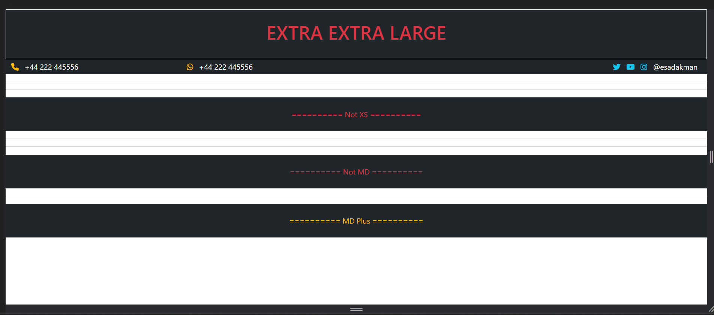

# html-bootstrap-responsive-navbar

## Description

Responsive navbar project made with bootstrap.

### At the end of the project, following topics are to be covered;

- HTML 

- CSS 

- Bootstrap

- Responsive design  

### At the end of the project, students will be able to;

- improve coding skills within HTML & CSS and Bootstrap

- use git commands (push, pull, commit, add etc.) and Github as Version Control System.

### Project Link 
 You can reach my project from [here](https://esadakman.github.io/html-bootstrap-responsive-navbar/) 👈

 ### Preview of the Project

 
 

